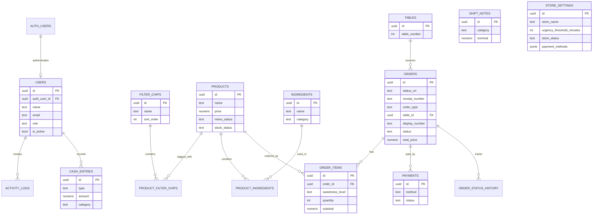

# Majamu ERD

> Diselaraskan dengan `CONFLICT_RESOLUTION.md`. Penambahan: `cash_entries`,
> `users.auth_user_id` (Supabase Auth), `orders.table_id`/`receipt_number`.

## Relationship Overview

auth.users (Supabase Auth)
└── users (profil owner/kasir via auth_user_id)
    ├── activity_logs
    └── cash_entries

filter_chips
└── product_filter_chips
    └── products
        └── product_ingredients
            └── ingredients

tables
└── orders
    ├── order_items
    ├── payments
    └── order_status_history

store_settings
shift_notes
banners
daily_sequences

---

## Mermaid ERD

