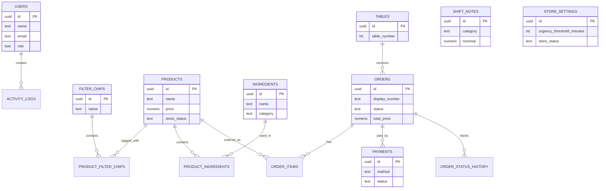

# Majamu ERD

## Relationship Overview

users
└── activity_logs

filter_chips
└── product_filter_chips
    └── products
        └── product_ingredients
            └── ingredients

tables
└── orders
    ├── order_items
    ├── payments
    └── order_status_history

store_settings
shift_notes
banners

---

## Mermaid ERD

